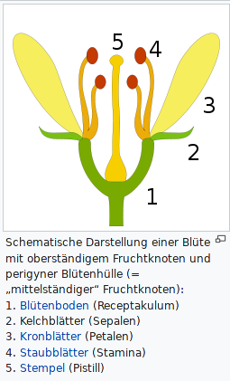
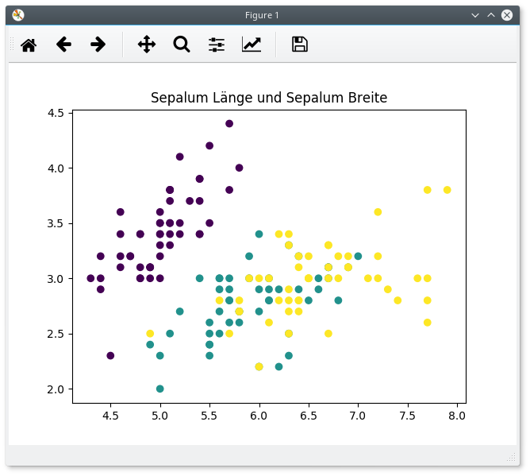
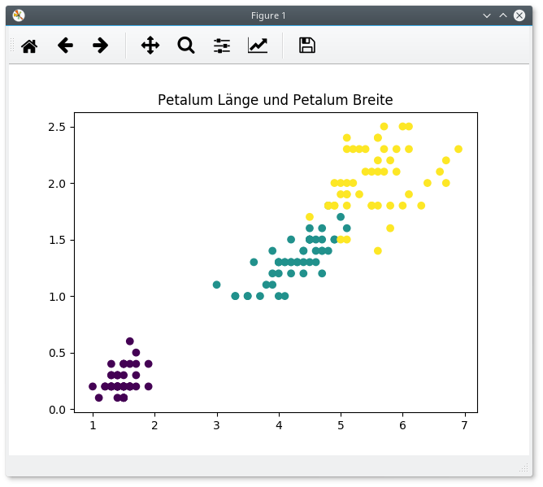

# Einführung in der Machine Learning mit Python

Das ist der erste einer Serie von Blogbeiträge über Machine Learning. Dafür werden wir die Programmiersprache Python verwenden. Die Blogbeiträge gehen davon aus, dass der Leser keinen Hintergrund in Statistikhat, aber Grundkenntnisse in Python besitzt und z.B. Python-Bibliotheken installieren kann.

## Was ist Machine Learning?

Machine Learning ist ein Gebiet der künstlichen Intelligenz, das als Ziel hat, Computerprogramme zu entwickeln, die selbständig von Daten lernen können und aufgrund dieser Daten präzise Vorhersagen oder Klassifizierunge liefern kann. Typische Probleme aus dem Bereich von Machine Learning sind:

- Der Preis von Aktien nach 6 Monaten vorhersagen, basiert auf Unternehmenleistungen und Wirtschaftsdaten.
- Die Ziffer einer Postleitzahl eines Bildes identifizieren.
- Risikofaktoren für Krebs aufgrund klinischen und demografischen Daten abschätzen.

Man unterscheidet zwischen mehreren Arten von Machine Learning: Supervised (beaufsichtigt) und unsupervised (unbeaufsichtigt) learning. Das beaufsichtigte Lernen verwendet die Eingabewerte *X* und die vorklassifizierten Daten *Y*. Das Ziel ist, eine Funktion *f()* zu finden, mit der *f(x) = y* ist. Dann kann man diese Funktion auf nicht vorklassifizierten Daten anwenden, um Klassifikationen zu erhalten.

Beim unbeaufsichtigten Lernen haben wir nur Eingabedaten *X*. Das Ziel ist es, Strukturen oder Muster innerhalb der Daten zu finden, mit deren Hilfe man mehr Information über die Daten erfahren kann. Diese Art von Lernen ist 'unbeaufsichtigt' genannt, weil es keine 'richtige' Antwort gibt.

Zwei weitere wichtige Begriffe sind *Klassifizierung* und *Regression*. Klassifizierung bedeutet, dass unsere Ausgabedaten *Y* keine metrische Darstellung haben. Zum Beispiel kann man damit mit dem Gewicht und der Größe die Hühnerart bestimmen. Ein Beispiel für Regression wäre es, wenn wir den Kaufpreis eines Hauses aufgrund der Lage, Größe und Anzahl der Zimmer bestimmen.

## Datensatz holen

Ich habe die Daten vom [UCI Machine Learning Repository](http://archive.ics.uci.edu/ml/datasets/Iris) geholt. Dort kann man viele verschiedene Datensätze finden, die alle kostenlos sind. 

Der Datensatz den ich gewählt habe ist sehr bekannt in der Machine-Learning-Literatur. Er bezieht sich auf drei Arten der Iris Blume. Gegeben sind Sepalumlänge, Sepalumbreite, Petalumlänge, Petalumbreite und Klasse von 150 Individuen. Wir wollen jetzt einen Algorithmus trainieren, Individuen aufgrund den Längen und Breiten zu klassifizieren. Wir verwenden dafür den kNN Algorithmus.



## Der kNN Algorithmus

KNN steht für *k nearest neighbours (k nächste Nachbarn)*.Das ist ein robuster und beaufsichtigter Algorithmus, der sowohl für Klassifizierung als auch für Regression benutzt werden kann. Zusätzlich wird kein Modell erstellt, sondern es werden alle Trainingsdaten bei jeder Klassifizierung geladen.
 
Das bedeutet, dass kNN keine Zeit für das Trainieren braucht, dafür entstehen durch den großen Datensatz hohe Hauptspeicherkosten bei der Klassifizierungsphase. Außerdem ist die Berechnung teuer, weil für jede Klassifizierung der ganze Datensatz iteriert werden muss.

## Wie funktioniert kNN?

KNN plottet alle Trainingsdaten in einen N-dimensionalen Vektorraum, wobei n die Dimension des Eingabevektors ist. In unserem Fall ist *n=4*, weil unsere Eingabewerte Sepalumlänge und -breite und Petalumlänge und -breite sind.

Für jedes Element das wir klassifizieren wollen, berechnen wir den Abstand zwischen dem Element und jedem Mitglieds der Trainingsdaten. Häufig verwendet man den euklidischen Abstand, aber es funktioniert auch mit anderen Abstandsmetriken.

Nachdem wir alle Abstände haben, nehmen wir *K* Elemente mit dem geringsten Abstand. Abhängig davon, ob wir ein Klassifikationsproblem oder ein Regressionsproblem haben, nehmen wir entweder die am meisten vorkommende Klasse als Ergebnis oder den Durchschnitt des Y Parameters der Trainingsdaten.

Wie wählt man ein *K* ? Das ist eine gute Frage. Wichtig für Machine Learning Algorithmen ist es, gute Hyperparameter zu wählen, damit die besten Ergebnisse herauskommen. Häufig verändert man Parameter, um den besten zu finden. In unserem Fall werden wir mit *k=5* versuchen.

## Code

Wir werden ein paar Bibliotheken für die Berechnung und Machine Learning verwenden: `pandas`, `numpy`, `matplotlib` und `scikit-learn`. Wir importieren alle Bilbliotheken und dann auch die Daten:

```python
import pandas as pd
import numpy as np
import matplotlib.pyplot as plt

from sklearn.neighbors import KNeighborsClassifier

# Datensatz laden und Spalten benennen 
df = pd.read_csv('iris.csv', header=None)
df.columns = ['sepalum_laenge', 'sepalum_breite', 'petalum_laenge', 'petalum_breite', 'klasse']

```

Die Arten von Iris Blumen sind als Zeichenketten (strings) gegeben. Das ist eine quantitative Variable und wir dadurch ergibt sich ein Klassifikationsproblem. Weil wir mit Zeichenketten nicht rechnen können, müssen wir qualitativen Variablen einen numerischen Wert zuordnen. In unserem Fall benutzen wird die `factorize` Methode von pandas:

```python
# Klasse der Datensatz als numerische Werte darstellen
df['klasse'] = pd.factorize(df['klasse'])[0]
```

```
   sepalum_laenge  sepalum_breite  petalum_laenge  petalum_breite  klasse
0             5.1             3.5             1.4             0.2       0
1             4.9             3.0             1.4             0.2       0
2             4.7             3.2             1.3             0.2       0
3             4.6             3.1             1.5             0.2       0
4             5.0             3.6             1.4             0.2       0
```

Jetzt wollen wir das Ergebnis anschauen und die Daten plotten. Wir verwenden dafür `matplotlib`. Zunächst wird in einem Fenster das erste Bild angezeigt. Schließt man es, erscheint das zweite Bild. Nachdem man das zweite Fenster geschlossen hat, läuft das Programm weiter.

```python
# Daten plotten
colors = list(df['klasse'])
plt.scatter(df['sepalum_laenge'], df['sepalum_breite'], c=colors)
plt.title("Sepalum Länge und Sepalum Breite")
plt.show()

plt.scatter(df['petalum_laenge'], df['petalum_breite'], c=colors)
plt.title("Petalum Länge und Petalum Breite")
plt.show()

```




Auch ohne einen Algorithmus kann man ein Klassifikationskriterium finden. Es gibt ein lineares Verhältnis zwischen Petalumlänge, Petalumbreite und Klasse der Blume. Jetzt wollen wir den Datensatz in Trainings- und Testdaten zerlegen. In der Regel nimm man für Testdaten zwischen 10 und 30 Prozent aller Daten. Wir nehmen 20 Prozent.

Wir benutzen dafür `DataFrame.sample(n)` um n beliebige Vektoren aus den Datensatz als Testdaten zu verwenden. Für Trainingsdaten nehmen wir den Rest mithilfe der `DataFrame.drop()` Funktion, die bestimmte Vektoren aus einer Tabelle entfernt.

```python
# Training- und Testdaten erzeugen
test = df.sample(int(len(df) * 0.2))
train = df.drop(df.index[test.index])

```

Jetzt sind wir fast fertig kNN anzuwenden. Wir benutzen die Implementierung von `scikit-learn`. Dafür ist aber erforderlich, dass die Daten in einer `numpy`-Array sind.

```python
## In numpy Arrays konvertieren
x_train = np.array(train.ix[:, 0:4])
y_train = np.array(train['klasse'])

x_test = np.array(test.ix[:, 0:4])
y_test = np.array(test['klasse'])
```

Die kNN Implementierung:

```python
## kNN Algorithmus

knn = KNeighborsClassifier(n_neighbors=5)

knn.fit(x_train, y_train)

pred = knn.predict(x_test)
```

So einfach war es. Zuerst erzeugen wir ein Klassifikator-Objekt, mit *k=5*. Dann werden die Daten geplottet, und danach erstellen wir einen Vektor mit alle Vorhersagen. Um die genauigkeit zu überprüfen bräuchten wir eine einfache Funktion.

```python
### Funktion, die die Genauigkeit der Vorhersage berechnet
def calculate_accuracy(pred, target):
    counter = 0

    for i in range(len(pred)):
        if pred[i] == target[i]:
            counter += 1

    return counter / len(pred)


print(calculate_accuracy(pred, y_test))

```

## Einen eigenen kNN Klassifikator entwickeln
Mit Hilfe des Pakets ist es einfach, ein kNN einzusetzen. Um zu wissen, wie genau kNN funktioniert, werden wir unsere eigene Implementierung entwickeln.

Das ist die Funktion, welche genau eine Vorhersage für ein Element gibt:

```python
def predict_one(k_neighbors, x_train, y_train, to_predict):
    
    distances = []
    neighbors = []

    # alle Abstände holen als (index, Vektor) speichern
    for i in range(len(x_train)):
        dst = np.linalg.norm(x_train[i] - to_predict)
        distances.append((i, dst))

    # liste nach Abstand sortieren
    distances.sort(key=lambda tup: tup[1])

    # k Nachbarn holen
    for i in range(k_neighbors):
        neighbors.append(y_train[distances[i][0]])

    # Ausgabe ist am meisten vorkommender Element
    return max(set(neighbors), key=neighbors.count)

```

Und das ist die kNN Implementierung. Die Funktion `predict_one()` wird nun für jedes Element aus den test Daten aufgerufen.

```python
def kNN(k_neighbors, x_train, y_train, x_test):

    predictions = []

    for vec in x_test:
        predictions.append(predict_one(k_neighbors, x_train, y_train, vec))
    
    return predictions
```

Zum Abschluss wird getestet, welches Ergebnis wir bekommen.

```python
pred = kNN(5, x_train, y_train, x_test)
print(calculate_accuracy(pred, y_test))
```

Wir sollen für beiden Algorithmen eine Genauigkeit zwischen *0,95* und *1.00* bekommen. Das bedeutet, dass die Daten sich sehr leicht durch KNN klassifizieren lassen. Außerdem ist kNN ein starker Algorithmus für Machine Learning, welcher auch sehr einfach zu Implementieren ist.

## Resourcen
- Ein anderes Tutorial für kNN (Englisch) - [Link](https://kevinzakka.github.io/2016/07/13/k-nearest-neighbor/)
- Pandas Dokumentation (Englisch) - [Link](http://pandas.pydata.org/pandas-docs/stable/)
- Wikipedia - Kelchblatt - [Link](https://de.wikipedia.org/wiki/Kelchblatt)


