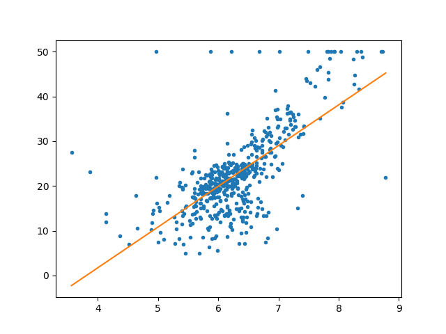
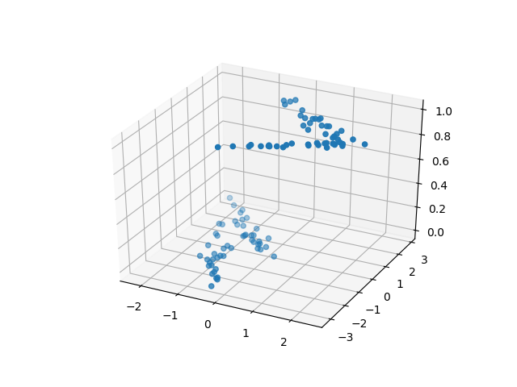

# Lineare Regression mit Python

Die lineare Regression ist ein statistisches Modell, das eine lineare Beziegung zwischen zwei oder mehr Variablen untersucht. Eine davon ist die abhängige Variable (auch erklärte gennant), die wir vorhersagen oder klassifizieren möchten. Wir haben auch mindestens eine unabhängige Varialbe (auch erklärende genannt).
Eine lineare Beziehung bedeutet formal, dass wir eine Funktion haben die so aussieht:

*Formel für lineares Modell hier*

*Erklärung der Notation*

Nicht formal bedeutet das, wenn der Wert einer der unabhängigen Variablen wächst, so wächst auch die abhängige Varialbe (oder sinkt, in diesem Fall sprechen wir von einer negativen linearen Beziehung). Unsere Aufgabe ist, wenn wir die Daten plotten, eine solche Linie zu ziehen, damit die mittlere quadratische Abstand von jeder Punkt zur Linie minimal ist. 
Das gilt natürlich für 2-dimensionale Daten. Für 3-Dimensionale Daten ist die Funktion keine Linie, sondern eine Ebene. 



Zusätzlich kann man ein lineares Modell auch für binäre Klassifizierung verwenden. Klassen werden typischerweise durch die Zahlen 0 und 1 dargestellt. Wegen der Natur des Algorithmus, bekommt man als Ergebnis vom Modell zahlen zwischen 0 und 1. Dann werden alle Zahlen größer als 0,5 auf 1 gesetzt und der Rest auf 0.

## Lineare Regression in Python

`Scikit-learn` ist ein mächtiges Machine Learning Framework. Das Modul `sklearn.linear_model` enthält viele Methoden die nützlich sind, wenn man eine abhängige Variable hat, die in lineares Verhältnis von den unabhängigen Variablen ist.
Außerdem werden wir `numpy` and `pandas` verwenden, die das Arbeiten mit Daten viel erleichtern, und `matplotlib` um Daten darzustellen.

### Datensatz

Für die Regressionsaufgabe werden wir einen Datensatz über Immobilenpreisen im Boston-Gebiet. Die Daten kommen ursprunglich vom Carnegie Mellon University und man kann ihn hier finden: [Link](http://www.cs.toronto.edu/~delve/data/boston/bostonDetail.html) 

Zusätzlich sind die Daten in `sklearn.datasets` vorhanden.

Man kann entweder den Link öffnen oder `data.DESCR` aufrufen um eine Beschreibung des Datensatzes zu bekommen, die aber auf Englisch ist. 

Im Datensatz sind zwei Afgaben zu finden:
- Der PREIS des Houses zu berechnen (*Die Aufgabe, die wir in diesem Tutorial lösen*)
- Stickstoffmonoxidniveaus (NOX) vorhersagen 

### Implementierung

Zuerst importieren wir alle nötige Bilbiotheken.

```python
import pandas as pd
import numpy as np
import matplotlib.pyplot as plt
from sklearn import linear_model
from sklearn import datasets
from sklearn.model_selection import train_test_split
```

Wie gesagt, wir können diesmal den Datensatz vom sklearn importieren. Trotzdem speichern wir ihn in eine Pandas DataFrame, damit es einfacher ist, verschiedene Attribute zuzugreifen.
Die rückgabe von `load_boston()` ist ein Wörterbuch, mit 4 Attributen:
- `data.data` - ein numpy-Array, die die 13 Attribute und deren Werte enthält. Eigentlich die X Menge.
- `data.target` - die *y* Menge, also 1-Dimensionales Array, das die Preise der Immobilien enthält
- `data.feature_names` - eine Liste mit den Namen der 13 Attribute
- `data.DESCR` - eine Zeichenkette der Beschrebung der Daten. Alle Attribute sind da erklärt.

```python
# Datensatz laden
data = datasets.load_boston()
df = pd.DataFrame(data.data)
df.columns = data.feature_names

target = pd.DataFrame(data.target)
target.columns = ["PRICE"]
```
Jetzt wollen wir die Daten für die Regression vorbereiten und dann sie analysieren. Zuerst wollen wir die in Test- und Trainingsdaten splitten. Dafür verwenden wir die Funktion `train_test_split()` von `sklearn.model_selection`, die ein 4-tupel von Arrays zurückgibt. Deswegen kann man einfach so machen:

```python
x_train, x_test, y_train, y_test = train_test_split(df, target, test_size=0.25, random_state=42)
```
Das verwendet 1/4 der Daten als Trainingsdaten, und weil wir ein `random_state` spezifiziert haben, werden bei jeder Ausfürung dieselben Daten als Testdaten gewählt.

Jetzt wollen wir das Regressionsmodell anpassen und dann das Ergebnis analysieren. 

```python
# Anpassen des linearen Modells
regr = linear_model.LinearRegression()
regr.fit(x_train, y_train)

# Koeffiziente der Regression
coef = pd.DataFrame({'features': df.columns, 'coef': regr.coef_[0]})
print(coef)
```

Wir verwenden die Trainigsdaten um das Modell anzupassen. So werden auch die Koeffiziente der Regression berechnet. Das sind die Zahlen, mit denen die unabhängige Variablen multipliziert werden, um die abhängige Variable zu berechnen. Das sind die Koeffizienten.

```
         coef features
0   -0.127825     CRIM
1    0.029521       ZN
2    0.049264    INDUS
3    2.775944     CHAS
4  -16.280196      NOX
5    4.360896       RM
6   -0.009191      AGE
7   -1.401720      DIS
8    0.257459      RAD
9   -0.009947      TAX
10  -0.924266  PTRATIO
11   0.013316        B
12  -0.518566    LSTAT
```

Es ist zu sehen, dass das Modell startk von den Variablen CHAS, NOX und RM abhängig ist. Wir können besser diese Abhängigkeiten plotten um besseren Überblick über die Beziehungen dieser Variablen zu bekommen. Wir bräuchten dafür eine einfache Funktion.

```python
def plot2d(x,y):
    fig = plt.figure()
    ax = fig.add_subplot(111)
    ax.scatter(x, y)
    plt.show()

# interessante Daten plotten
plot2d(df.NOX, target)
plot2d(df.RM, target)
plot2d(df.CHAS, target)

```

[NOX](figures/figure_NOX)
[RM](figures/figure_RM)
[CHAS](figures/figure_CHAS)

Man kann für NOX ein negatives lineares und für RM ein positives lineares Verhältnis erkennen. Es ist aber schwierig ein Muster für CHAS zu finden, weil das eine binäre Variable ist. Wir merken und diese Information und erzeugen zuerst Hervorsagen mit alle 13 Attributen.

```python
def mean_squared_error(y,y_hat):
    return np.mean((y - y_hat) ** 2)

# Vorhersage plotten
pred = regr.predict(x_test)
plot2d(y_test, pred)

# Mittlere Quadratfehler
mse = mean_squared_error(y_test, regr.predict(x_test))
print("Mittlere Quadratfehler: %f" % mse)

>> Mittlere Quadratfehler: 22.11516
```

Eine gute Metrik für die Genauigkeit eines Regressionsmodell ist die mittlere Quadratfehler. Das ist das Quadrat der Differenz zwischen die Vorhersagen und die aktuelle Werte von *y*. Eine kleiere Zahl bedeutet eine akkuratere Vorhersage. Wir haben eine eigene Funktion erstellt, man kann aber auch `regr.score(X,y)` verwenden. Das gibt eine Zahl zwischen 0 und 1, wobei eine größere Zahl eine bessere Vorhersage beduetet.

Zusätzlich haben wir auch die Vorhersage geplottet. Es ist zu sehen, dass diese ziemlich akkurat ist, aber es gibt Ausweichungen für teurere Wohnungen.

*Bild hier*

Wir haben alle 13 Variablen benutzt für dieses Modell. Wir wollen jetzt schauen, ob wir auch ein gutes Ergebnis mit wenigen Variablen erreichen können. Wir werden dafür nur die NOX und RM Attributen verwenden, da bei denen eine starke lineare Beziehung zu erkennen ist. 

```python
new_X = df[["RM", "NOX"]]

regr = linear_model.LinearRegression()
regr.fit(new_X, target)

mse = mean_squared_error(target, regr.predict(new_X))
print("Mittlere Quadratfehler: %f" % mse)

>> Mittlere Quadratfehler: 39.56231
```

Man sieht, dass zwei Variablen nicht genug sind, um so ein gutes Ergebnis wie mit 13 Variablen zu erreichen. Trotzdem ist der Unterschied zwischen beide Modelle nicht so groß. 


### Klassifizierung mit dem linearen Modell

Man kann dieses Modell auch für Klassifizierung verwenden. Wie gesagt, das lineare Modell funktioniert nur für binäre Klassifizierung, deswegen brauchen wir einen Datensatz mit nur zwei Klassen. Ich hatte schwierigkeiten einen solchen Datensatz zu finden, deswegen ist das auch die perfekte möglichkeit zu zeigen, wie man mithilfe von `sklearn` einen Datensatz generieren kann.

Ich empfehle, dass man eine andere Datei für diesen Abschnitt verwendet. Importieren wir zuerst die nötige Bibliotheken.

```python
import pandas as pd
import numpy as np
from sklearn.linear_model import LinearRegression
from sklearn.datasets import make_classification
import matplotlib.pyplot as plt
from mpl_toolkits.mplot3d import Axes3D
```

Das Modul `sklearn.datasets` enthält nicht nur viele Datensätze, sondern auch Funktionen, die für die Generierung von Datensätze sorgen. Wir verwenden die Funktion `make_classification`, die Klassifizierungsdaten erzeugt. Rückgabewert sind zwei numpy-Arrays - unabhängige bzgws. abhängige Variablen. Man kann viele Parameter anpassen. Die Dokumentation befindet sich hier: [Link](http://scikit-learn.org/stable/modules/generated/sklearn.datasets.make_classification.html)

```python
X,y = make_classification(n_samples=100, n_features=2, n_informative=1, n_redundant=1)
```

Wichtige Parameter:
- `n_samples` - Die Anzahl von Stichproben, die wir haben wollen.
- `n_features` - Die Anzahl von Merkmale, die wir haben wollen. Ich habe mich für 2 entschieden, um die Daten in 3D plotten zu können
- `n_informative`, `n_redundant`, `n_repeated` - Eigenschaften der Merkmale. Es muss gelten dass die Summe dieser drei Paramenter muss gleich `n_features` sein.
- `n_classes` - Anzahl von Klassen. 2 in unserem Fall, weil wir eine binäre Klassifizierung wollen
- `n_clusters_per_class` - Wie viele Cluster pro Klasse wir haben wollen. Mehr als 1 bedeutet, dass die Stichproben einer Klasse mehr als 1 Cluster bilden. Es muss auch die folgende Gleichung gelten: `n_clusters * n_clusters_per_class <= 2 ** n_informative`

Um die Daten in diesem Tutorial darstellen zu können brauchen wir zwei Funktionen. Die erste stellt einen dreidimensionalen Datensatz dar und die zweite stellt zwei Datensätze mit verschiedenen Farben dar.

```python
def plot3d(x,y,z):
    fig = plt.figure()
    ax = fig.add_subplot(111, projection='3d')
    ax.scatter(x,y,z)
    plt.show()

def plot_prediction3d(x1,y1,z1, x2,y2,z2):
    fig = plt.figure()
    ax = fig.add_subplot(111, projection='3d')
    ax.scatter(x1,y1,z1, alpha=0.5)
    ax.scatter(x2,y2,z2)
    plt.show()

# Zufallsdaten darstellen
plot3d(X[:,0], X[:,1], y)
```



Weil die Daten zufällig generiert worden sind, sehen sie bei jeder Ausführung anders aus. Um jedes Mal die gleichen Daten zu erzeugen kann man für die `make_classification` Funktion zusätzlich das Parameter `random_state=` auf eine Zahl setzen.

Jetzt können wir das lineare Modell anpassen und die Vorhersagen berechnen. 

```python
regr = LinearRegression()
regr.fit(X,y)
```

Für die Genauigkeit dieses Modells kann man eine andere Metrik verwenden. Da es nur zwei Klassen im Datensatz gibt, ist die Vorhersage entweder richtig oder falsch. Zusätzlich werden die zwei Klassen durch 0 oder 1 bezeichnet. In Numpy kann man zwei Vektoren der gleiche Form so vergleichen: `a == b` Das Ergebnis ist ein Vektor mit der selben Dimension und `True` oder `False` als Werte, abhängig davon ob an dieser Stelle Vektoren `a` und `b` gleich sind. Zunächst können wir diesen neuen Vektor summieren und wir bekommen die Zahl von korrekt klassifizierten Stichproben.

```python
def classification_score(y, y_hat):
    correct = np.sum(y == y_hat)
    return correct/len(y)

print("Klassifikationsgüte vor Anpassung: %f: " % classification_score(y, regr.predict(X)))
plot_prediction3d(X[:,0], X[:,1], y, X[:,0], X[:,1], regr.predict(X))
```


Was man hier bekommt ist aber eine Regression. Die Vorhersagen sind Fließkommazahlen und sind nicht durch 1 oder 0 begrenzt. Deswegen ist auch die Klassifikationsgüte 0. Wir müssen die Vorhersagen anpassen und benutzen dafür eine eigene Funktion:

```
def classification_score(y, y_hat):
    correct = np.sum(y == y_hat)
    return correct/len(y)

y_hat = fix_predictions(regr.predict(X))

print("Klassifikationsgüte nach Anpassung: %f: " % classification_score(y, y_hat))
plot_prediction3d(X[:,0], X[:,1], y, X[:,0], X[:,1], y_hat)
```


```
>> Klassifikationsgüte vor Anpassung: 0.000000: 
>> Klassifikationsgüte nach Anpassung: 0.870000:
```

## Resourcen
- Git-Repository - [Link](https://gitlab.com/emomicrowave/machine-learning-tutorials/tree/master/02-linear_regression)
- Andere Tutorials auf Englisch 
[Link 1](http://bigdata-madesimple.com/how-to-run-linear-regression-in-python-scikit-learn/)
[Link 2](https://medium.com/towards-data-science/simple-and-multiple-linear-regression-in-python-c928425168f9)

### Dokumentation
- [sklearn.datasets.load_boston](http://scikit-learn.org/stable/modules/generated/sklearn.datasets.load_boston.html#sklearn.datasets.load_boston)
- [sklearn.datasets.make_clasification](scikit-learn.org/stable/modules/generated/sklearn.datasets.make_classification.html)
- [sklearn.liear_model.LinearRegression](http://scikit-learn.org/stable/modules/generated/sklearn.linear_model.LinearRegression.html)
