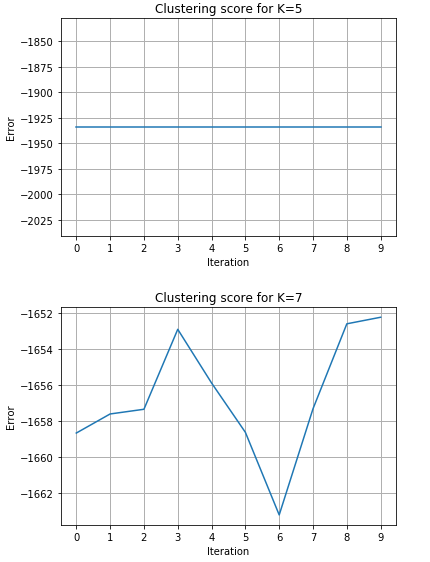
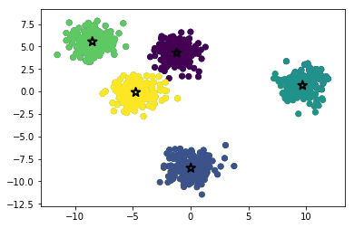

# Einführung

Das ist der dritte Teil einer Serie von Blogbeiträge über Machine learning mit Python. In diesem Tutorial, beschäftigen wir uns mit unbeaufsichtigten Lernen 
und werden Clusteranalyse mit dem K-means Algorithmus implementieren. Grundkenntnisse in Python sind empfohlen. Außerdem ist es empfohlen sich die vorherigen Tutorials anzusehen. 

## Was ist Clusteranalyse

Clusteranalyse ist ein unbeaufsichtigtes Verfahren in den Machine Learning und Data Mining, wobei man Gruppen von ähnlichen Objekten in unbeschrifteten Daten finden will. 
Diese Art von Analyse hat Anwendungen in verschiedenen Bereichen wie Marketing (neue Kundengruppen auf basis ihrer Einkäufe zu identifizieren), 
Biologie (Klassifizierung von Individuen oder Gen-Sequenzierung), Sozialwissenschaften (Kriminalität Hotspots identifizieren) und viele andere.


## K-Means

K-Means steht für K-Mittelwerte und ist ein iterativer Algorthmus für Clusteranalyse. Als Eingabe bekommt der Algorithmus eine Zahl *K* und den Datensatz (Sammlung von Merkmale für jede Stichprobe) 
und versucht danach K unterschiedliche Gruppen im Datensatz zu erkennen. 


### Initialisierung

Die erste Schritt ist die Zentroiden der Clustern zu initialisieren. Am häufigsten nimmt man entweder K zufällige Stichproben aus dem Datensatz, oder K zufällige Punkte dazwischen. 


### Verteilung der Daten unter den Clustern

Die nächste Schritt ist jede Stichprobe in einen Cluster hinzufügen. Am häufigsten verwendet man der quadrat der euklidischen Abstand für eine Metrik. Das heißt es wird für jede Stichprobe das nächstliegende Zentroid gewählt.

### Aktualisierung der Mittelwerte

Zunächst werden die neuen Mittelwerte für jeden Cluster berechnet.


### Iteration

Die letzten zwei Schritte werden so viel wiederholt bis der Algorithmus ein Stoppkriterium erreicht. Das kann eine Obergrenze der Iterationen sein, oder eine Untergrenze der Veränderung der Koordinaten der Zentroiden. Der Algorithmus konvergiert immer,
es kann aber sein, dass das keine optimale Lösung ist, und man muss mehrfach den Alorithmus ausführen.


## Implementierung mit Python und sklearn

Für die Implemetierung verwenden wir die folgenden Python-Bibliotheken:
- `sklearn` und `numpy` für algebraische Berechnungen und für eine Implementierung von K-means
- `matplotlib` für dreidimensionalen Datendarstellung

```python
import numpy as np
from random import randint
import matplotlib.pyplot as plt
from sklearn.cluster import KMeans
from sklearn.datasets import make_blobs
```


### Scikit-Learn

Die Bibliotheke Scikit-Learn enthält Implementierungen einer vielfalt von Machine Learning Algorithmen. Das Modul `sklearn.cluster` enthält viele Clustering Algorithmen. 
Wir verweden die Klasse `KMeans` als bereitgestellte Implementierung des K-Means Algorithmus. 

Das sind die wichtigsten Parameter für die Initialisierung der `KMeans` Klasse:
- `n_clusters` - eigenlich das K Parameter
- `init` - ('k-means++', 'random' oder [ndarray]) - Das Verfahren für die Anfangskoordinaten der Zentroiden.
  - falls *k-means++* werden 'klugerweise' Koordinaten gewählt, damit die Zentroiden schneller konvergieren
  - falls *random* werden zufälligerweise Koordinaten generiert
  - man kann auch eine Array als Argument geben und so bestimmte Koordinaten für die Zentroiden wählen
- `n_init` - wie viel wird der Algorithmus ausgeführt bevor das beste Ergebnis zurückgegeben wird
- `max_iter` - die maximale Anzahl von Iterationen bevor der Algorithmus aufhört

Wichtige Methoden der `KMeans` Klasse:
- `fit(X)` - Führt K-Means clustering aus
- `predict(X)` - ergibt die Klasse (Cluster), einer oder mehrere Stichproben
- `score(X)` - Eine Metrik für die Abstand zwischen den Clusterzentren und den dazugehörigen Stichproben

Wichtige Attribute der `KMeans` Klasse:
- `cluster_centers_` - eine Array der Länge *K*, wobei jedes Element die Zentrumkoordinaten eines Clusters ist
- `labels_` - eine Array mit dem gleichen Anzahl von Elementen wie die Eingabe, die Bezeichner der Cluster enthält, 
zu denen die Eingabeelemente

### Datensatz

Jetzt brauchen wir einen Datensatz und werden einen mit `sklearn` generieren. Die Funktion `make_blobs` aus dem Modul `sklearn.datasets` kann gaussische Flecken generieren. 
Die funktion gibt zwei Mengen zurück - die Stichproben und deren Merkmale, und die Klassen der Stichproben. Die Klassen brauchen wir für diese Aufgabe nicht.
Außerdem habe ich das parameter `random_state` festgelegt, damit wir bei jeder Programmverlauf die gleiche Anzahl von Clustern haben und so besser die Parameter konfigurieren können.
Das heißt das die Stichproben im Zentrum der Flecke dichter aneinander sind als die am Rand. Wir möchten auch die Daten plotten und dafür brauchen wir eine Funktion.

```python
# Funktion, die zweidimensionalen Daten plottet
def plot2d(x,y, colors=None):
    fig = plt.figure()
    ax = fig.add_subplot(111)
    ax.scatter(x,y, c=colors)
    plt.show()

# Datensatz generieren
data, classes = make_blobs(n_samples=1000, centers=randint(3,8), random_state=42)
plot2d(data[:,0], data[:,1])
```


### Wie wählt man eine K?

Es ist offensichtlich wie viele Cluster hier sind, wir gehen aber davon aus, dass wir diese Information nicht haben. Für hochdimensionalen Daten, man kann schwer den Datensatz plotten und die Cluster durch betrachten erkennen. Wir verwenden die sogenannte elbow-point (Ellenbogen-Punkt).
Wir führen das Clustering aus für unterschiedliche Parameter K und verwenden die Summe der Quadratabstände der Stichproben zum nächstliegenden Zentroid. Natürlich durch das Erhöhen des Parameters K wird der Abstand sinken. 
Es gibt aber einen Punkt, so dass für kleinere Ks die Sinkung stärker ist, und für größere Ks, die Sinkung viel kleiner ist. Das ist die sogenannte Ellenbogen-Punkt und auch das perfekte K parameter für den bestimmten Datensatz.

```python
# Funktion, die ein Liniendiagramm zeichnet
def plot_cluster_score(x,y):
    fig = plt.figure()
    ax = fig.add_subplot(111)
    ax.plot(x,y,'-')
    plt.show()

# Iteration um das perfekte K zu finden 
# und das Ergebnis zu plotten
scores = []
for i in range(1,11):
    print("Clustering mit K=%d" % (i))
    kmeans = KMeans(n_clusters=i)
    kmeans.fit(data)
    scores.append([i, kmeans.score(data)])

# einfacher Daten zu plotten wenn sie ein numpy-array sind, aber
# einfacher Daten in einer python-Liste hinzufügen
scores = np.array(scores)
plot_cluster_score(scores[:,0], scores[:,1])
```


Es ist zu sehen, dass k=5 für diesen Datensatz am besten geeignet ist. Deswegen erstellen wir eine Variable `K_PARAM = 5`, die wir für die weitere Schritte benutzen und zusätzlich einfach verändern können.

### Validierung

Da die Koordinaten der Zentroiden bei jedem Verlauf zufällig initialisiert werden, kann passieren, dass die Endergebnisse auch unterschiedlich sind. Bei großen Abweichungen kann das bedeuten, dass die Daten gar nicht für Clustering durch K-means geeignet sind.
Deswegen werden wir das Clustering 10 mal laufen lassen und dann die Summe der Quadratabstände für jede Iteration plotten. Je flacher die Linie ist, desto stabiler den Algorithmus für diesen Datensatz.

```python
# Iterieren um festzustellen, wie sich die Summe der Abstände
# sich für die nächste 10 Iteration verändert
scores = []
for i in range(10):
    print("Running iteration %d" % (i))
    kmeans = KMeans(n_clusters=K_PARAM)
    kmeans.fit(data)
    scores.append([i, kmeans.score(data)])

scores = np.array(scores)
plot_cluster_score(scores[:,0], scores[:,1])
```



Dem Diagramm zufolge sind die Daten und die K perfekt für K-Means. Jetzt können wir zum letzten mal das Clustering ausführen und das Endergebnis plotten.

```python
# Clustering zum letzten mal Ausführen und
# Endergebnis in unterschiedliche Farben plotten
print("Executing k-means for the last time")
kmeans = KMeans(n_clusters=K_PARAM)
kmeans.fit(data)

print("Plotting data...")
plot2d(data[:,0], data[:,1], kmeans.labels_)

```



Es ist zu sehen, dass der Algorithmus sehr gut die verschiedenen Gruppen erkannt hat.

## Feature Engineering und Validierung

Da Clusteranalyse eine Art unbeaufsichtigtes Lernen ist, gibt es in der Praxis keine Testdaten, mit denen wir eine Klassifikationsgüte bestimmen kann, deswegen muss man selber Maßnahmen nehmen, um zu prüfen ob die Ergebnisse des Algorithmus Sinn machen.

Der hier benutzte Datensatz wurde zufällig generiert und hat deswegen keinen Bezug zum realen Welt und zusätzlich haben wir alle Merkmale des Datensatzes als Parameter eingesetzt. 
In der Praxis muss man sich auf seinen Domainwissen und Erfahrung verlassen um nur zur aktuellen Aufgabe relevante Merkmale für die Analyse zu verwenden. Das nennt man Feature Engineering.

Nachdem man den KMeans Algorithmus ausgeführt hat soll man das Endergebnis Validieren. Machen die erkannte Cluster Sinn im Kontext der bestimmten Domain? Datenvisualisierung ist oft eine gute Methode, aber nicht besonders effektiv für hochdimensionalen Daten. Wie sieht das Ergebnis aus, wenn man andere Clustering-Algorithmen verwendet. 
Das ist aber ein sehr breites Thema und nicht im Rahmen des Blogbeitrags. Es gibt aber ein gutes Paper, über unterschiedliche Clustering Algorithmen und die Validierung ihrer Ergebnisse. (link unten)

## Dokumentaition

- [sklearn.cluster.KMeans](http://scikit-learn.org/stable/modules/generated/sklearn.cluster.KMeans.html#sklearn.cluster.KMeans)
- [sklearn.datasets.make_blobs](http://scikit-learn.org/stable/modules/generated/sklearn.datasets.make_blobs.html#sklearn.datasets.make_blobs)

## Resourcen

- Git-Repository: [Link](https://gitlab.com/emomicrowave/machine-learning-tutorials/tree/master/03-k_means_clustering)
- Clustering Tutorial auf Englisch: [Link](https://www.datascience.com/blog/introduction-to-k-means-clustering-algorithm-learn-data-science-tutorials)
- On Clustering Validation Techniques - Paper by Maria Halkidiki, Yannis Batistakis, Michalis Vazirgiannis - [Link](http://web.itu.edu.tr/sgunduz/courses/verimaden/paper/validity_survey.pdf)


