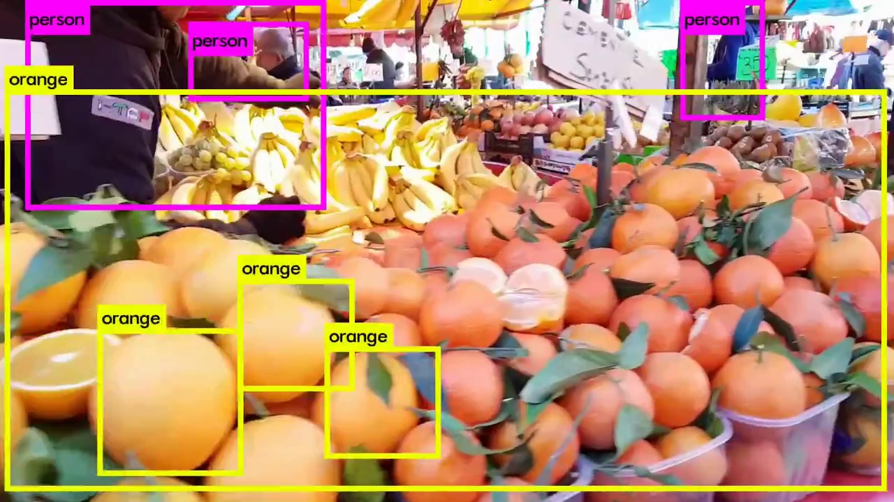
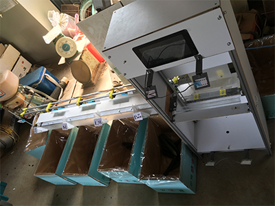
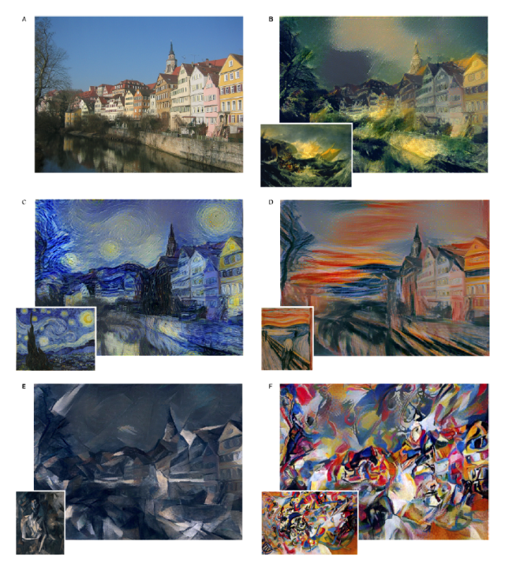
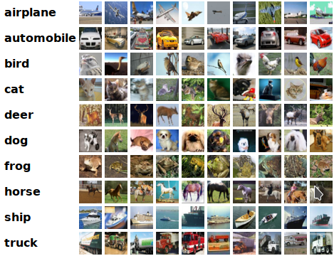
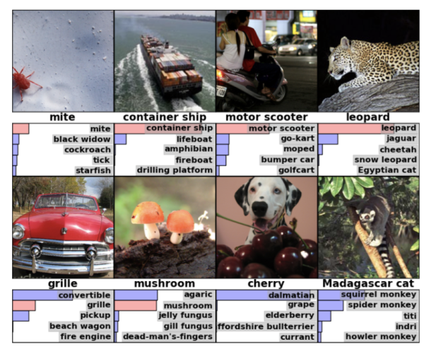

# Deep Learning mit TensorFlow und mögliche Anwendungsfälle
*Deep Learning* ist kein neues Konzept im maschinellen Lernen, aber es ist in der letzten Jahren sehr populär geworden. Eigentlich ist Deep Learning nur ein schicker Name für künstliche mehrschichtige neuronale Netze. Die Idee dahinter war, einen selbstlernenden Algorithmus zu entwickeln, der das menschliche Gehirn nachahnt. Neuronale Netze bestehen aus Schichten (Neuronen), die mit benachbarten Schichten verbunden sind. Je mehr Schichten es gibt, desto "tiefer" das Netz.

Ein Merkmal von Deep Learning Modellen ist die große Menge an Daten, die sie für effektives Training benötigen. Dies führt zusammen mit den vielen Schichten und Neuronen innerhalb des Netzwerkes zu der Notwendigkeit einer hohen Rechenleistung. Um das zu erreichen sollen Deep Learning Modelle auf Servern mit mehreren Grafikkarten laufen können, oder sogar auf verteilten Systemen und Cloud Computing Diensten wie z.B Google Cloud, AWS oder Azure. Damit hilft auch TensorFlow.

*TensorFlow* ist eine Open Source Bibliothek für Machine Learning, die von Google erstellt worden ist. Am Anfang war die Idee diese Framework für interne Zwecke zu verwenden. Trotzdem wurde die unter eine Open Source Lizenz veröffentlichen, mit dem Ziel der Deep Learning und Machine Learning Forschung. TensorFlow ist nicht nur ideal für Forschung, sondern auch für echte Produkte, da er schnell, übertragbar und einsatzbereit ist.

Es wurde festgestellt, dass es viel billiger und schneller ist, Grafikkarten (GPUs) und GPU-Cluster zum Trainieren neuronaler Netze zu verwenden. Zum Vergleich: Normale Prozessoren haben wenige, aber spieziallisierte Kerne, die für die Ausführung komplexer sequentieller Anweisungen optimiert sind. Die GPUs dagegen können nur einfache mathematische Operationen durchführen. Allerdings haben GPUs Hunderte von Kernen, was bedeutet, dass sie Hunderte von mathematischen Operationen gleichzeitig ausführen können.

Deswegen bietet auch TensorFlow ein leistungsfähiges Backend, das es ermöglicht, ein Modell auf einer oder mehreren GPUs zu beitreiben oder einfach in verteilte Systeme zu integrieren. Nicht nur das, sondern bietet er auch verschiedene APIs in verschiedenen Sprachen (Python, C++, Java, Go, u.a) damit man einfach ein Machine Learning Modell erstellen, trainieren und bereitstellen kann.

## Wofür nutzen Unternehmen TensorFlow
TensorFlow hat viele Stärke wie z.B Bilderkennung. Firmen wie Amazon und Netflix verwenden es um eine Datenbank zu erstellen mit welchen Objekten sich in verschiedenen Szenen aus Filmen oder Serien befinden. Zusätzlich wird auch Gesichtserkennung angewendet, um eine Liste von Schauspielern in der aktuellen Szene.

Eine andere Anwendung von Bilderkennung mit TensorFlow ist in der Landwirschaft. Indem ein ehemaliger Designer der japanischen Automobilindustrie seiner Familie auf der Gurkenfarm half, entdeckte er, dass das Sortieren der Gurken eine sehr anstrengedne Aufgabe ist, die seine Elter manuell ausführen. Als Setup benutzte er einen Raspberry Pi mit einer Kamera und einem kleinen neuronalen Netzwerk, das prüft ob das Bild eine Gurke ist. Wenn dies der Fall ist, wird das Bild zur detaillierteren Klassifizierung an ein größeres neuronales Netzwerk auf einem Linux-Server gesendet. Der Designer musste zuerst 7000 Bilder von sortierten Gurken manuell aufnehmen. Dann dauerte das Training des Modells 2 oder 3 Tage, weil es auf einem normalen Windows-PC lief. Obwohl das Setup relativ einfach ist, hat es 70% der Gurken korrekt klassifiziert und zeigt ein großes Verbesserungspotential.

Hier ist ein weiterer Anwendungsfall von TensorFlow: Firmen erhalten jeden Tag zu viele E-Mails. Bis vor kurzem wurden sie meist in der Reihenfolge ihrer Ankunf verarbeitet. Ein Problem wurde in Notfällen entstehen, wenn das Unternehmen zu viele E-Mails erhält, um sie effektiv zu verarbeiten. Eine Möglichkeit, dieses Problem zu lösen, besteht darin, *Natural Language Processing* zu verwenden, um die Stimmung und das Thema eingehender E-Mails zu verstehen und ihnen automatisch Priorität zuzuweisen.

## Interessante Projekte
### Neural Style
Eine interessante Anwendung von TensorFlow sieht man im [*Neural Style* Projekt](https://github.com/cysmith/neural-style-tf) auf Github. Der Algorithmus synthesiert einen Pastiche: ein künstlerisches Werk, das offen das Werk eines vorangegangenen Künstlers imitiert. In diesem Fall wird der Inhalt eines Bildes mit dem Stil eines anderen Bildes kombiniert. Unten sieht man eine Reihe von Häusern im Tübingen mit Blick auf den Neckar, kombiniert mit den Kunststilen verschiedener Gemälde.

*arXiv - [A Neural Algorithm of Artistic Style](https://arxiv.org/abs/1508.06576) - (2015) Gatys, Ecker, Bethge*

### Transfer Learning
Was TensorFlow auch bietet, sind vortrainierte Modelle für Objekterkennung in Bildern, die sich perfekt für *Transfer Learning* eignen. Transfer Learning besteht darin, die bereits vorhandenen ersten Schichten der Modelle und die nützlichen Abstraktionen drin zu verwenden und so nur die obersten Schichten von Grund auf zu trainieren. Die Verwendung dieser Methode führt zu viel schnelleren Trainingszeiten und man benötigt nicht so große Datensätze, um eine gute Genauigkeit zu erreichen. Ein Beispiel wäre das [ Umtrainieren des *Inception*-Modells zur Klassifizierung von Blumen. ](https://www.tensorflow.org/tutorials/image_retraining)

Andere Modelle kann man hier finden: [Link](https://github.com/tensorflow/models)

### Sonstige
Die Github-Repository [*Awesome TensorFlow*](https://github.com/jtoy/awesome-tensorflow) enthält zahlreiche interessante Projekte sowie Tutorials, Videos und Blogbeiträge.

## Probieren Sie es selbst aus
Wenn Sie TensorFlow selbst ausprobieren möchten. bietet die [offizielle Website](https://www.tensorflow.org/) viele Tutorials zu Themen wie die Installation des Frameworks und die Implementierung eingener Image-Klassifikatoren. Typische Anfänger-Datensätze sind *MNIST, CIFAR10 und ImageNet*.

### MNIST

Die MNIST-Datenbank ist eine große Datenbank, die handgeschriebene Ziffern enthält und wird häufig zum Trainieren von neuronalen Netzen für Bildverarbeitungssysteme verwendet.

### CIFAR10

Der CIFAR-10 Datensatz ist eine Sammlung von Bildern, die üblicherweise zum Trainieren von *Machine Learning*- und *Computer Vision*-Algorithmen verwendet werden. Er besteht aus 60 000 32x32 Bilndern in 10 verschiedenen Klassen. Die Klassen sind Flugzeuge, Autos, Vögel, Katzen, Rehe, Hunde, Frösche, Pferde, Schiffe und Lastwagen und das Ziel des Algorithmus ist es, sie unterscheiden zu können.

### ImageNet

Das ImageNet-Projekt ist eine große visuelle Datenbank, die für den Einsatz in Objekterkennungssoftware entwickelt wurde. Es bietet 14 Millionen Links zu handannotierten Bildern und hat ca. 20 000 Klassen. Es gibt auch die jährliche *ImageNet Large Scale Visual Recognition Challenge*, bei der Forscherteams ihre Algorithmen anhand des gegebenen Datensatzes auswerten und um eine höhere Genauigkeit bei mehreren Aufgaben konkurieren.
