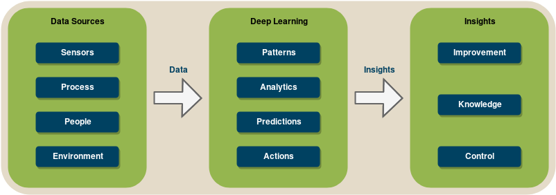

# Deep Learning mit TensorFlow und mögliche Anwendungsfälle
*Deep Learning* ist kein neues Konzept im *Machine Learning*, aber es ist in den letzten Jahren sehr populär geworden. Eigentlich ist "Deep Learning" nur ein schicker Name für künstliche mehrschichtige neuronale Netze. Die Idee dahinter war, einen selbstlernenden Algorithmus zu entwickeln, der das menschliche Gehirn nachahmt. Neuronale Netze bestehen aus Schichten (Neuronen), die mit benachbarten Schichten verbunden sind. Je mehr Schichten es gibt, desto "tiefer" das Netz.

Ein Merkmal von Deep Learning Modellen ist die große Menge an Daten, die sie für effektives Training benötigen. Dies führt, zusammen mit den vielen Schichten und Neuronen innerhalb des Netzwerkes dazu, dass hohe Rechenleistungen benätigt werden. Um das zu erreichen sollten Deep Learning Modelle auf Servern mit mehreren Grafikkarten, oder sogar auf verteilten Systemen und Cloud Computing Diensten wie z.B Google Cloud, AWS oder Azure laufen können. Dabei hilft auch TensorFlow.

*TensorFlow* ist eine Open Source Bibliothek für Machine Learning, die von Google erstellt wurde. Am Anfang bestand die Idee, dieses Framework nur für interne Zwecke zu verwenden. Trotzdem wurde es unter einer Open Source Lizenz veröffentlicht, und steht der Deep Learning- und Machine Learning-Forschung zur Verfügung. TensorFlow ist nicht nur ideal für Forschung, sondern auch für echte Produkte, da es schnell, übertragbar und immer einsatzbereit ist.

Es ist kostengünstiger und schneller, Grafikkarten (GPUs) und GPU-Cluster zum Trainieren neuronaler Netze zu verwenden. Zum Vergleich: Normale Prozessoren haben wenige, aber spiezialisierte Kerne, die für die Ausführung komplexer sequentieller Anweisungen optimiert sind. Die GPUs dagegen können nur einfache mathematische Operationen durchführen. Allerdings haben GPUs hunderte von Kernen, was bedeutet, dass sie hunderte von mathematischen Operationen gleichzeitig ausführen können.

Deswegen bietet TensorFlow auch ein leistungsfähiges Backend, das es ermöglicht, ein Modell auf einer oder mehreren GPUs zu betreiben oder einfach in verteilte Systeme zu integrieren. Zusätzlich bietet es auch verschiedene APIs in verschiedenen Sprachen (Python, C++, Java, Go, u.a) damit ein Machine Learning Modell simpel erstellt, trainiert und bereitgestellt werden kann.

## Wofür nutzen Unternehmen TensorFlow?
Mit der zunehmenden Beliebtheit von Deep Learning beginnen immer mehr Unternehmen, Deep Learning aus verschiedenen Gründen zu übernehmen. Da Maschinen immer mehr mit Sensoren ausgestattet und über Funknetzwerke miteinander verbunden werden, hat man die Möglichkeit, eine Vielzahl von Daten zu sammeln und zu unterschiedlichen Zwecken auszuwerten. Die gewonnenen Erkenntnisse werden z.B. zur Charakterisierung und Reduzierung von Fehlern in Produktionsmaschinen, zur Prognose des Ressourcenbedarfs in Lieferketten, zur Automatisierung und Optimierung von Prozessen, wie z.B. dem Routing von Maschinen oder Personen in Lagern und vielen weiteren Anwendungen genutzt.

Obwohl es sich hierbei nicht um ein konkretes Beispiel für TensorFlow-Anwendungsfälle handelt, könnte TensorFlow durchaus zur Entwicklung von Lösungen für diese Probleme verwendet werden, da es bereits über die erforderliche Funktionalität verfügt. Unten sind konkretere Beispiele für Anwendungsfälle von TensorFlow aufgeführt.

TensorFlow hat viele Stärken, wie z.B Bilderkennung. Firmen wie Amazon und Netflix verwenden es, um eine Datenbank zu erstellen. Diese verschafft einen Überblick darüber, welche Objekte sich in verschiedenen Szenen aus Filmen oder Serien befinden. Zusätzlich wird auch Gesichtserkennung angewendet, um eine Liste von Schauspielern in der aktuellen Szene zu erstellen.

Die Bilderkennung mit TensorFlow findet auch in der Landwirtschaft Anwendung. Bei seiner Arbeit auf einer Gurkenfarm stellte ein ehemaliger Designer der japanischen Automobilindustrie fest, dass das Sortieren der Gurken mühselige Arbeit war. Seine Idee: Ein Raspberry Pi mit einer Kamera und einem kleinen neuronalen Netzwerk als Setup nutzen, das prüft, ob in dem Bild eine Gurke zu sehen ist. Wenn dies der Fall ist, wurde das Bild zur detaillierteren Klassifizierung an ein größeres neuronales Netzwerk auf einem Linux-Server gesendet. Dafür musste der Designer vorab 7000 Bilder von sortierten Gurken manuell aufnehmen. Das Trainieren des Modells benötigte dann etwa zwei bis drei Tage, da es auf einem normalen Windows-PC lief. Obwohl das Setup relativ einfach war, hat es 70% der Gurken korrekt klassifiziert und brachte enorme Verbesserungen mit sich.

Ein weiterer Anwendungsfall von TensorFlow: Firmen erhalten jeden Tag E-Mails zuhauf. Bisher werden sie meist in der Reihenfolge ihrer Ankunft bearbeitet. Ein Problem entsteht allerdings dann, wenn das Unternehmen zu viele E-Mails empfängt, um sie effektiv bearbeiten zu können. Eine Möglichkeit, dieses Problem zu lösen, besteht darin, *Natural Language Processing* zu verwenden, um die Stimmung und das Thema eingehender E-Mails zu verstehen und ihnen automatisch Prioritäten zuzuweisen.

## Interessante Projekte
### Neural Style
Eine interessante Anwendung von TensorFlow sieht man im [*Neural Style* Projekt](https://github.com/cysmith/neural-style-tf) auf Github. Der Algorithmus synthesiert einen Pastiche: ein künstlerisches Werk, das offensichtlich das Werk eines vorangegangenen Künstlers imitiert. In diesem Fall wird der Inhalt eines Bildes mit dem Stil eines anderen Bildes kombiniert. Unten sieht man eine Reihe von Häusern im Tübingen mit Blick auf den Neckar, kombiniert mit den Kunststilen verschiedener Gemälde.

*arXiv - [A Neural Algorithm of Artistic Style](https://arxiv.org/abs/1508.06576) - (2015) Gatys, Ecker, Bethge*

### Transfer Learning
Was TensorFlow auch bietet, sind vortrainierte Modelle für Objekterkennung in Bildern, die sich perfekt für *Transfer Learning* eignen. Transfer Learning besteht darin, die bereits vorhandenen ersten Schichten der Modelle und die nützlichen Abstraktionen darin zu verwenden und so nur die obersten Schichten von Grund auf zu trainieren. Die Verwendung dieser Methode führt zu deutlich kürzeren Trainingszeiten und man benötigt keine großen Datensätze, um eine gute Genauigkeit zu erreichen. Ein Beispiel wäre das [ Umtrainieren des *Inception*-Modells zur Klassifizierung von Blumen. ](https://www.tensorflow.org/tutorials/image_retraining)

Andere Modelle kann man hier finden: [Link](https://github.com/tensorflow/models)

### Sonstige
Die Github-Repository [*Awesome TensorFlow*](https://github.com/jtoy/awesome-tensorflow) enthält zahlreiche interessante Projekte sowie Tutorials, Videos und Blogbeiträge.

## Probieren Sie es selbst aus
Wenn Sie TensorFlow selbst ausprobieren möchten. bietet die [offizielle Website](https://www.tensorflow.org/) viele Tutorials zu Themen wie die Installation des Frameworks und die Implementierung eigener Image-Klassifikatoren. Typische Anfänger-Datensätze sind *MNIST, CIFAR10 und ImageNet*.

### MNIST

Die MNIST-Datenbank ist eine große Datenbank, die handgeschriebene Ziffern enthält und wird häufig zum Trainieren von neuronalen Netzen für Bildverarbeitungssysteme verwendet wird.

### CIFAR10

Der CIFAR-10 Datensatz ist eine Sammlung von Bildern, die üblicherweise zum Trainieren von *Machine Learning*- und *Computer Vision*-Algorithmen verwendet werden. Sie besteht aus 60 000 32x32 Bildern zu zehn verschiedenen Objekten. Diese Objekte sind Flugzeuge, Autos, Vögel, Katzen, Rehe, Hunde, Frösche, Pferde, Schiffe und Lastwagen. Das Ziel des Algorithmus ist es, sie unterscheiden zu können.

### ImageNet

Das ImageNet-Projekt ist eine große visuelle Datenbank, die für den Einsatz in Objekterkennungssoftware entwickelt wurde. Es bietet 14 Millionen Links zu handannotierten Bildern und hat ca. 20 000 Klassen. Es gibt auch die jährliche *ImageNet Large Scale Visual Recognition Challenge*, bei der Forscherteams ihre Algorithmen anhand des gegebenen Datensatzes auswerten und um eine höhere Genauigkeit bei mehreren Aufgaben konkurrieren.
